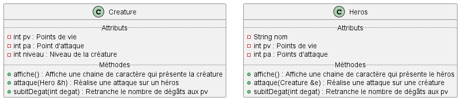
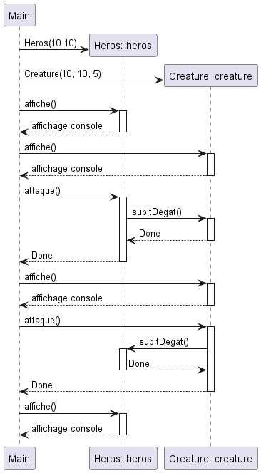

# WS n°1

## Partie 1

Créez une classe `Voiture` qui propose une méthode `void demarer()`. Cette méthode affichera le message `VROUMMMM !` lorsqu'elle sera appelée.

Instanciez deux objets de type voiture dans le programme principal en utilisant l'allocation statique puis l'allocation dynamique.

## Partie 2

Étudiez les fichiers disponibles dans le répertoire Partie2.

Réalisez le `.cpp` de la classe `CLcalcul` de manière à faire fonctionner le programme.

## Partie 3

1. Afin de modéliser la fraction, on définit la classe `Fraction` avec deux attributs : `numerateur`, et `denominateur`. La classe doit permettre de faire les quatre opérations principales : Addition/Soustraction/Multiplication/Division de deux fractions. Implémentez la classe et les méthodes associées.
2. Réalisez le diagramme de classe.
3. Réalisez le diagramme de séquence pour les quatre opérations.

## Partie 4

Dans cette partie nous allons créer notre premier jeu vidéo. Bienvenue dans **CESI & dragons** !

Dans un premier temps, notre jeu sera assez simple (basique quoi), il sera composé de deux types de personnages : les Héros et les Créatures. Ces personnages s'affronteront lors de combats sans merci.

Pour vous aider, nous avons retrouvé dans de vieux parchemins les diagrammes de classe et de séquence suivants :

### Partie 4.1 Les bases

1. À partir du diagramme de classe fourni, définissez les classes `Heros` et `Creature`
2. Implémentez les méthodes `affiche()`, `attaque()`, `subitDegat()`. *(Définissez les attaques comme bon vous semble, mais n'oubliez pas que dans toutes les attaques il y a une part d'aléatoire.)*
3. Réalisez le programme principal à partir du diagramme de séquence.

### Partie 4.2 et si on jouait ?

1. Réalisez une interface en ligne de commande permettant à un joueur de contrôler le héros.
2. Implémentez les fonctionnalités suivantes :
   - Utilisation d'armes
   - Utilisation de potions magiques
   - Sauvegarde de la partie dans un fichier
